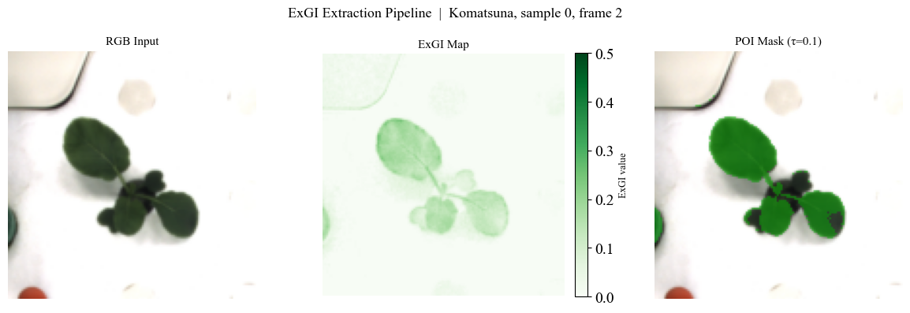
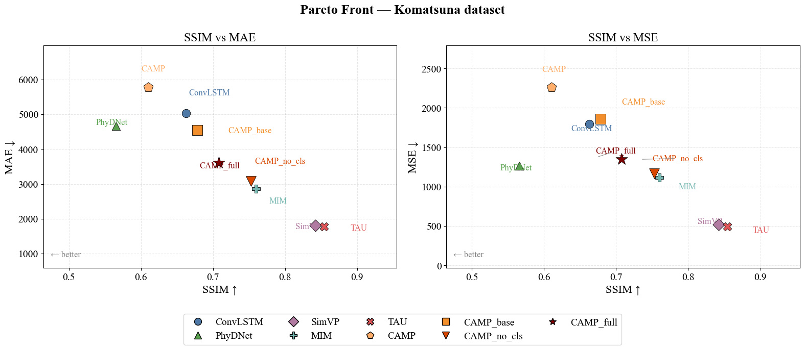
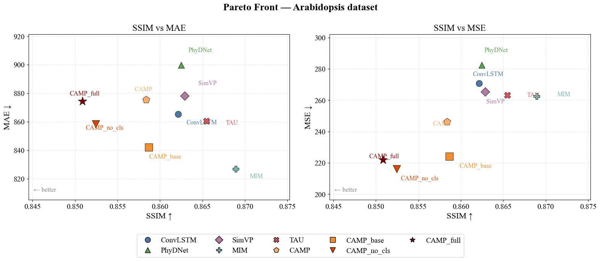
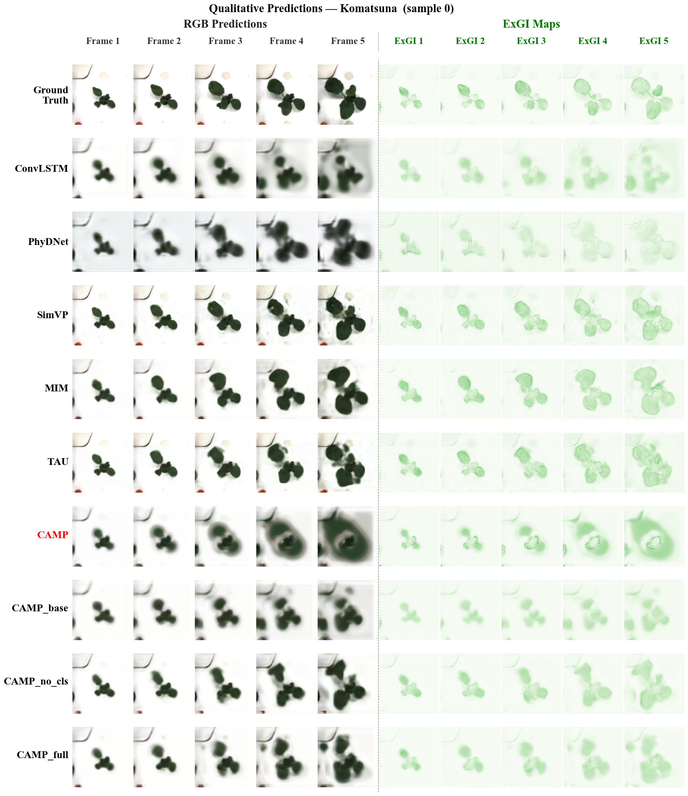
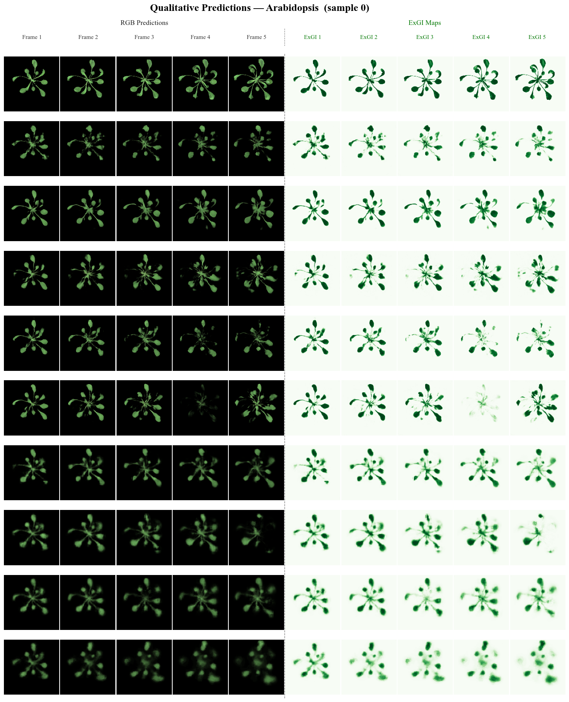
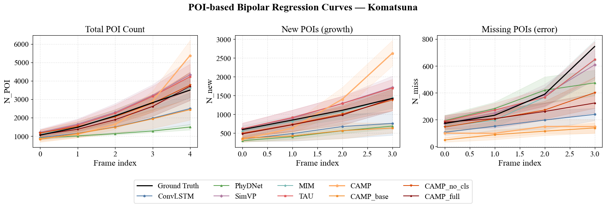
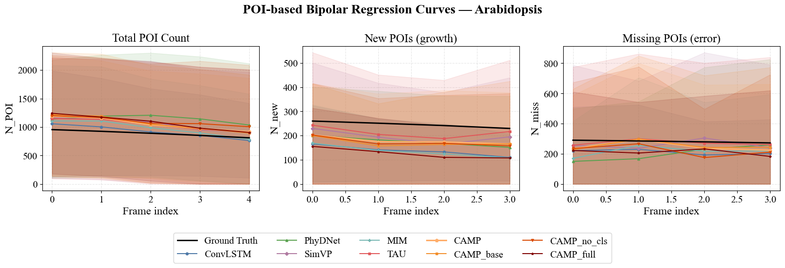

# CAMP-Plant 🌱

### Classification-Assisted Multi-task Plant Growth Prediction

<p align="left">
<a href="LICENSE">
  </a>


</p>

---

CAMP-Plant is a **spatiotemporal video prediction benchmark for plant growth**, built on the
[OpenSTL](https://github.com/chengtan9907/OpenSTL) framework.
It introduces the **CAMP** (Classification-Assisted Multi-task Prediction) model family, which
augments standard recurrent predictors with a biologically-grounded auxiliary objective — predicting
plant pixels via the **Excess Green Index (ExGI = 2G − R − B)** — to improve leaf-level temporal
prediction.

We evaluate **10 spatiotemporal methods** on two plant datasets
(**Komatsuna** and **Arabidopsis**) across **5 metrics**, with full statistical analysis:
bootstrap 95% confidence intervals, pairwise Wilcoxon signed-rank tests, threshold sensitivity
sweeps, and a novel **POI (Plant-of-Interest) bipolar regression** framework for growth-curve analysis.

📓 **[Full analysis notebook →](CAMP_results_analysis.ipynb)**  
🌐 **[Interactive HTML results →](CAMP_results_analysis.html)**

---

## Table of Contents

- [Overview](#overview)
- [Key Results](#key-results)
- [Qualitative Predictions](#qualitative-predictions)
- [POI Growth Curve Analysis](#poi-growth-curve-analysis)
- [Installation](#installation)
- [Dataset Preparation](#dataset-preparation)
- [Training](#training)
- [Reproducing the Analysis](#reproducing-the-analysis)
- [Methods](#methods)
- [Citation](#citation)
- [Acknowledgements](#acknowledgements)

---

## Overview

### The CAMP Multi-task Objective

Standard spatiotemporal models optimise only pixel-level reconstruction loss (MSE).
CAMP adds two auxiliary objectives that encode plant-domain knowledge:

| Component | What it adds | Key effect |
|-----------|-------------|------------|
| **ExGI regression loss** | Supervises leaf-pixel prediction via ExGI = 2G − R − B | +54% POI_MAE on Komatsuna |
| **Classification head** | Predicts crop-type label alongside future frames | Marginal gain (requires valid labels) |

<p align="center">
  
  <br><em>Figure 1. ExGI pipeline: RGB frames are converted to an excess-green map; pixels above
  threshold τ = 0.10 define the Plant-of-Interest (POI) region used for the auxiliary loss and
  the POI_MAE evaluation metric.</em>
</p>

### CAMP Variants (Ablation)

Four variants isolate each component's contribution:

| Variant | Backbone | ExGI loss | Cls. head |
|---------|----------|-----------|-----------|
| **CAMP_base** | PredRNN | ✗ | ✗ |
| **CAMP** | PredRNN | ✗ | ✓ (invalid labels¹) |
| **CAMP_no_cls** | PredRNN | ✓ | ✗ |
| **CAMP_full** | PredRNN | ✓ | ✓ |

> ¹ Komatsuna has no crop-level species labels; classification supervision degrades performance,
> confirming the label-validity requirement.

Ablation results (Komatsuna, 150 epochs, signed % vs. CAMP_base):

| Variant | Δ MAE | Δ SSIM | Δ POI_MAE |
|---------|------:|-------:|----------:|
| CAMP_base | 0% | 0% | 0% |
| CAMP | −27.5% | −10.0% | −11.6% |
| CAMP_no_cls | **+32.6%** | **+11.0%** | **+53.7%** |
| CAMP_full | +20.7% | +4.4% | **+54.2%** |

---

## Key Results

All results are at **150 training epochs** with bootstrap **95% confidence intervals** (B = 5,000).
Full scoreboard in [`work_dirs/combined_scoreboard_ep150.csv`](work_dirs/combined_scoreboard_ep150.csv).

### Komatsuna (30 test sequences)

| Method | MAE ↓ | SSIM ↑ | PSNR ↑ | POI_MAE ↓ |
|--------|------:|-------:|-------:|----------:|
| ConvLSTM | 25,010 | 0.663 | 16.28 | 641.5 |
| PredRNN | 22,540 | 0.678 | 16.06 | 638.2 |
| PhyDNet | 23,330 | 0.566 | 16.78 | 1,034 |
| SimVP | 8,620 | 0.842 | 21.62 | 351.0 |
| MIM | 14,040 | 0.760 | 18.34 | 270.1 |
| TAU | **8,373** | **0.854** | **21.88** | 295.5 |
| CAMP | 28,740 | 0.610 | 15.42 | 712.5 |
| CAMP_base | 22,540 | 0.678 | 16.06 | 638.2 |
| CAMP_no_cls | 15,200 | 0.753 | 18.31 | 295.3 |
| CAMP_full | 17,880 | 0.708 | 17.39 | **292.5** |

### Arabidopsis (468 test sequences)

| Method | MAE ↓ | SSIM ↑ | PSNR ↑ | POI_MAE ↓ |
|--------|------:|-------:|-------:|----------:|
| ConvLSTM | 4,271 | 0.862 | 26.08 | 383.1 |
| PredRNN | 4,199 | 0.859 | 27.36 | 353.0 |
| PhyDNet | 4,499 | 0.863 | 26.37 | 382.3 |
| SimVP | 4,290 | 0.863 | 26.81 | 307.6 |
| MIM | **4,106** | **0.869** | 26.37 | 328.8 |
| TAU | 4,213 | 0.866 | **26.92** | **293.9** |
| CAMP | 4,347 | 0.858 | 26.84 | 342.0 |
| CAMP_base | 4,199 | 0.859 | 27.36 | 353.0 |
| CAMP_no_cls | 4,282 | 0.852 | **27.41** | 358.4 |
| CAMP_full | 4,352 | 0.851 | 27.28 | 388.1 |

### Multi-objective Pareto Front (SSIM vs POI_MAE)

<p align="center">
  
  <br><em>Figure 2a. Pareto front — Komatsuna. CAMP_full and CAMP_no_cls are Pareto-optimal:
  no single baseline achieves simultaneously better SSIM <em>and</em> better POI_MAE.</em>
</p>

<p align="center">
  
  <br><em>Figure 2b. Pareto front — Arabidopsis. TAU and MIM lead on the SSIM–POI_MAE frontier.</em>
</p>

---

## Qualitative Predictions

Each grid shows **10 future frames** predicted by all 10 methods vs. ground truth.

<p align="center">
  
  <br><em>Figure 3a. Qualitative predictions — Komatsuna. TAU and SimVP produce the sharpest textures;
  ConvLSTM and PredRNN blur progressively over longer horizons.</em>
</p>

<p align="center">
  
  <br><em>Figure 3b. Qualitative predictions — Arabidopsis. Methods show tighter spread; rosette
  morphology (symmetric leaf arrangement) is generally well-captured.</em>
</p>

---

## POI Growth Curve Analysis

The **bipolar regression** framework decomposes prediction error into:
- **Total POI count** — how many leaf pixels the model predicts overall
- **New POIs** — leaf pixels present in prediction but absent in ground truth (false new leaves)
- **Missing POIs** — leaf pixels present in ground truth but absent in prediction (missed leaves)

<p align="center">
  
  <br><em>Figure 4a. POI growth curves — Komatsuna. CAMP_full and CAMP_no_cls track the ground-truth
  total leaf count most closely; PhyDNet systematically over-predicts new leaves.</em>
</p>

<p align="center">
  
  <br><em>Figure 4b. POI growth curves — Arabidopsis. All methods undercount total POIs at late frames,
  reflecting the difficulty of long-horizon rosette prediction.</em>
</p>

---

## Installation

### 1. Clone the repository

```bash
git clone https://github.com/ARLabXiang/CAMP-Plant
cd CAMP-Plant
```

### 2. Create environment

**Option A — conda (recommended):**
```bash
conda env create -f environment.yml
conda activate camp-plant
pip install -e .
```

**Option B — pip:**
```bash
pip install -r requirements.txt
pip install -e .
```

**Additional analysis dependencies:**
```bash
pip install adjustText scipy scikit-image matplotlib pandas
```

---

## Dataset Preparation

### Komatsuna
Download from the [Komatsuna Dataset page](http://limu.ait.kyushu-u.ac.jp/~agri/komatsuna/).
Place under `data/komatsuna/`.

### Arabidopsis
A custom time-lapse dataset of *Arabidopsis thaliana* rosettes under controlled greenhouse
conditions. Contact the authors for access.

Expected directory structure:
```
data/
├── komatsuna/
│   ├── train/
│   └── test/
└── arabidopsis/
    ├── train/
    └── test/
```

---

## Training

All configs are in `configs/plant/`. Train any method with:

```bash
# Example: train CAMP_full on Komatsuna for 150 epochs
python tools/train.py \
    --config configs/plant/camp_full.py \
    --dataset komatsuna \
    --epoch 150

# Example: train TAU on Arabidopsis
python tools/train.py \
    --config configs/plant/TAU.py \
    --dataset arabidopsis \
    --epoch 150
```

Available configs: `ConvLSTM.py`, `PredRNN.py`, `PhyDNet.py`, `SimVP.py`, `MIM.py`,
`TAU.py`, `camp.py`, `camp_base.py`, `camp_no_cls.py`, `camp_full.py`

---

## Reproducing the Analysis

After training, run the following tools in order to regenerate all figures and statistics:

```bash
DATASET=komatsuna   # or arabidopsis
EPOCH=150

# 1. Compute POI metrics
python tools/eval_poi.py --dataset $DATASET --epoch $EPOCH

# 2. Bootstrap 95% confidence intervals (B=5000)
python tools/bootstrap_ci.py --dataset $DATASET --epoch $EPOCH -B 5000

# 3. Statistical significance tests (Wilcoxon + Cohen's d)
python tools/significance_test.py --dataset $DATASET --epoch $EPOCH --metric mae
python tools/significance_test.py --dataset $DATASET --epoch $EPOCH --metric ssim
python tools/significance_test.py --dataset $DATASET --epoch $EPOCH --metric poi_mae

# 4. Combined scoreboard (both datasets)
python tools/combined_scoreboard.py --epoch $EPOCH

# 5. ExGI threshold sensitivity sweep
python tools/threshold_sensitivity.py --dataset $DATASET --epoch $EPOCH

# 6. Publication figures (Pareto, ExGI pipeline, qualitative grid, POI curves)
python tools/visualize_results.py --dataset $DATASET --epoch $EPOCH

# 7. Qualitative sample grids + per-sample POI overlays
python tools/visualize_predictions.py --dataset $DATASET --epoch $EPOCH
```

All outputs go to `work_dirs/{dataset}_ep{epoch}_analysis/` and `figures/{dataset}_ep{epoch}/`.
Every figure is saved as both **PNG** (for display) and **PDF** (for editing in Illustrator).

Open the analysis notebook for the full write-up:

```bash
jupyter notebook CAMP_results_analysis.ipynb
# or open the pre-rendered HTML:
open CAMP_results_analysis.html
```

---

## Methods

### Baselines (re-used from OpenSTL — full credit to original authors)

The following backbones and their reference implementations are adopted **without modification** from the [OpenSTL](https://github.com/chengtan9907/OpenSTL) framework (Tan et al., NeurIPS 2023).  We thank the original authors for open-sourcing these implementations under Apache 2.0.

| Method | Type | Original Paper |
|--------|------|----------------|
| ConvLSTM | Recurrent | [Shi et al., NeurIPS 2015](https://arxiv.org/abs/1506.04214) |
| PredRNN | Recurrent (ST-LSTM) | [Wang et al., NeurIPS 2017](https://arxiv.org/abs/2103.09504) |
| PhyDNet | Physics-informed | [Guen & Thome, CVPR 2020](https://arxiv.org/abs/2003.01460) |
| SimVP | Non-recurrent CNN | [Gao et al., CVPR 2022](https://arxiv.org/abs/2206.05099) |
| MIM | Memory-in-memory | [Wang et al., NeurIPS 2019](https://arxiv.org/abs/1811.07490) |
| TAU | Temporal Attention | [Tan et al., CVPR 2023](https://arxiv.org/abs/2206.12126) |

### Our contributions (built on top of the baselines above)
                         
The CAMP method family adds biology-grounded auxiliary supervision (ExGI regression + binary classification head) on top of the OpenSTL backbones.  The cross-backbone variants in the second block are introduced in this revision to characterize when CAMP's recipe transfers across architectural families.

| Method | Backbone | What we add | Source |
|--------|----------|-------------|--------|
| CAMP_base | PredRNN | (none — pure backbone reference) | This work |
| CAMP | PredRNN | + classification head | This work |
| CAMP_no_cls | PredRNN | + ExGI regression loss | This work |
| CAMP_full | PredRNN | + ExGI + classification | This work |
| MIM_full | MIM | + ExGI + classification | This work (extends MIM) |
| TAU_full | TAU | + ExGI + classification (joint training) | This work (extends TAU) |
| TAU_no_cls | TAU | + ExGI only (no classification head) | This work (extends TAU) |
| TAU_full_clsw01 | TAU | + ExGI + classification (cls weight = 0.1) | This work (extends TAU) |
| TAU_full_detached | TAU | + ExGI + classification head with detached gradient (linear-probe style) | This work (extends TAU) |
| TAU_PredCls | TAU | + ExGI + late-fusion classification on predicted frames | This work (extends TAU) |
| SimVP_full | SimVP | + ExGI + classification | This work (extends SimVP) |
| SimVP_no_cls | SimVP | + ExGI only | This work (extends SimVP) |
| SimVP_PredCls | SimVP | + ExGI + late-fusion classification | This work (extends SimVP) |

---

## Citation

> **Note:** The CAMP-Plant paper is currently in preparation / under review.
> A formal citation will be added here once the paper is published.
> In the meantime, if you use this codebase, please cite it as:

```bibtex
@misc{zhou_camp_plant,
  author       = {Zhou, Anni and Wang, Kun and Liu, Yuchen and Xu, Dongkuan (DK) and Xiang, Lirong},
  title        = {CAMP-Plant: Classification-Assisted Multi-task Plant Growth Prediction},
  year         = {2026},
  note         = {Software repository (paper in preparation)}
}
```

This codebase builds on OpenSTL. Please also cite the OpenSTL framework:

```bibtex
@inproceedings{tan2023openstl,
  title     = {OpenSTL: A Comprehensive Benchmark of Spatio-Temporal Predictive Learning},
  author    = {Tan, Cheng and Li, Siyuan and Gao, Zhangyang and Guan, Wenfei and
               Wang, Zedong and Liu, Zicheng and Wu, Lirong and Li, Stan Z},
  booktitle = {NeurIPS 2023 Datasets and Benchmarks Track},
  year      = {2023}
}
```

If you use any of the baseline backbones below, please also cite the original papers:

```bibtex
@inproceedings{shi2015convlstm,
  title     = {Convolutional LSTM Network: A Machine Learning Approach for Precipitation Nowcasting},
  author    = {Shi, Xingjian and Chen, Zhourong and Wang, Hao and Yeung, Dit-Yan and Wong, Wai-Kin and Woo, Wang-chun},
  booktitle = {NeurIPS},
  year      = {2015}
}

@inproceedings{wang2017predrnn,
  title     = {PredRNN: Recurrent Neural Networks for Predictive Learning using Spatiotemporal LSTMs},
  author    = {Wang, Yunbo and Long, Mingsheng and Wang, Jianmin and Gao, Zhifeng and Yu, Philip S},
  booktitle = {NeurIPS},
  year      = {2017}
}

@inproceedings{wang2019mim,
  title     = {Memory in Memory: A Predictive Neural Network for Learning Higher-Order Non-Stationarity from Spatiotemporal Dynamics},
  author    = {Wang, Yunbo and Zhang, Jianjin and Zhu, Hongyu and Long, Mingsheng and Wang, Jianmin and Yu, Philip S},
  booktitle = {NeurIPS},
  year      = {2019}
}

@inproceedings{guen2020phydnet,
  title     = {Disentangling Physical Dynamics from Unknown Factors for Unsupervised Video Prediction},
  author    = {Guen, Vincent Le and Thome, Nicolas},
  booktitle = {CVPR},
  year      = {2020}
}

@inproceedings{gao2022simvp,
  title     = {SimVP: Simpler yet Better Video Prediction},
  author    = {Gao, Zhangyang and Tan, Cheng and Wu, Lirong and Li, Stan Z},
  booktitle = {CVPR},
  year      = {2022}
}

@inproceedings{tan2023tau,
  title     = {Temporal Attention Unit: Towards Efficient Spatiotemporal Predictive Learning},
  author    = {Tan, Cheng and Gao, Zhangyang and Wu, Lirong and Xu, Yongjie and Xia, Jun and Li, Siyuan and Li, Stan Z},
  booktitle = {CVPR},
  year      = {2023}
}
```

---

## Acknowledgements

CAMP-Plant is built on top of [OpenSTL](https://github.com/chengtan9907/OpenSTL)
(NeurIPS 2023 Datasets & Benchmarks Track). We thank the OpenSTL team at Westlake University
for their open-source benchmark framework.

Plant datasets used:
- **Komatsuna** — Uchiyama et al., *CVPR Workshops* 2017
- **Arabidopsis** — custom greenhouse dataset

ExGI vegetation index:
- Woebbecke et al., *Trans. ASAE* 38(1), 1995
- Hague et al., *Computers and Electronics in Agriculture* 2006
